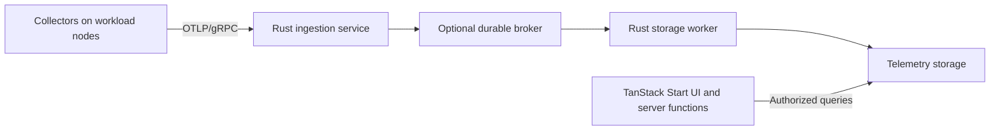

# Architecture

The system collects resource measurements from distributed workloads and relates them to executions, processes, and nodes. Live views and post-mortem analysis use the same measurements. Workload-specific details are metadata, so collection and analysis can support different applications.

The web application is a TanStack Start scaffold with TanStack Query and shadcn/ui. The Rust collector is a scaffold. The Tonic server exposes gRPC health checks and OTLP service interfaces; export handling, durable publication, storage, and authentication are not implemented.

## Component responsibilities

| Component                  | Responsibility                                                                                                                  |
| -------------------------- | ------------------------------------------------------------------------------------------------------------------------------- |
| Rust collector             | Collect node and process measurements, attach execution context, batch samples, and buffer pending uploads.                     |
| Rust ingestion service     | Authenticate sources, validate batches, apply admission limits, and publish accepted telemetry durably.                         |
| Storage worker             | Consume retained batches, process measurements, and publish analytical data.                                                    |
| TanStack Start application | Render the interface with SSR, manage browser sessions, and authorize queries and exports through server-side application code. |
| Broker, if selected        | Retain accepted batches independently of processing and track consumer progress.                                                |

TanStack Start provides the web application's server-side functions and endpoints. Collectors export telemetry to the Rust ingestion service. Human sessions and execution access are managed in the web application; collector authentication and durable acceptance are enforced by the ingestion service.

The storage worker is a separate component responsibility. Its deployment and analytical storage interface remain to be selected. The ingestion executable serves telemetry export and health RPCs.

## Data flow

Collectors send OTLP batches over gRPC with binary Protobuf. The ingestion service validates identity, access, schema, and size before acceptance. With a broker, acceptance follows successful publication; processing then writes measurements to analytical storage. Without a broker, acceptance follows a durable storage commit.

The broker belongs behind the ingestion API. Collectors need neither broker credentials nor knowledge of topics, partitions, or consumers.

See [ingestion server](ingestion-server.md) for the Tonic choice and receiver behavior, [ingestion and reliability](ingestion-and-reliability.md) for acceptance and recovery, [broker options](broker-options.md) for broker alternatives, and [serialization](serialization.md) for formats at each boundary.

## Storage and recordings

Rust is used for collection and ingestion. DuckDB is a candidate for analytical queries, with Parquet for retained measurements and exports. Telemetry transport uses OTLP/gRPC with binary Protobuf; retained ingestion records use a Protobuf envelope, and web endpoints use JSON. Storage integration and the broker remain open.

DuckDB's embedded read-write mode uses one writer process, which can have multiple threads. The storage worker and TanStack Start cannot independently open the same writable database file as a shared storage interface. Published Parquet files can provide an analytical boundary; another queryable storage service is an alternative. Adding broker consumers does not make a shared DuckDB file writable from multiple processes. [DuckDB concurrency](https://duckdb.org/docs/current/connect/concurrency)

A hosted platform can retain recordings centrally. Portable exports are an additional way to share a capture, reproduce an analysis, or inspect measurements offline. An export needs units, timestamps, execution and node identifiers, collection settings, and a schema version alongside the samples. Arrow and Parquet are candidate interchange and storage formats; export is independent of broker replay.

Broker retention covers processing recovery. Historical storage has its own retention policy for post-mortem analysis. Expiring a broker record should not delete its archived measurements.

## Identity and privacy

Browser authentication and collector authentication serve different purposes. SAML SSO is a candidate for human login. Collectors use separate credentials scoped to their permitted nodes and projects. TanStack Start enforces execution access on queries and exports; the ingestion service enforces source and project access on incoming telemetry.

SSO establishes identity; authorization determines which measurements that identity can access. Broker connections belong to backend services, with permissions limited to the streams or topics they need.

Use encrypted transport outside the isolated local environment. Collect only the process metadata needed for attribution; command arguments, environment variables, and workload payloads can contain private data. Retention and export permissions apply to raw captures as well as derived results.

## Measurements and validation

Each measurement needs its source, unit, collection time, and node or process context. Preserve missing samples, collector disconnections, and clock uncertainty. A shared timeline can reveal correlated changes; a controlled experiment is needed to attribute a slowdown to a competing workload.

The [test environment](../infra/test-environment/README.md) provides two Vagrant VMs provisioned with Ansible and the Tonic server in Compose. Standard gRPC health probes check connectivity. Separate workload playbooks run stress-ng for CPU and memory pressure and fio for I/O, with commands, tool versions, and results retained locally. Export handlers remain unimplemented until a durable sink is configured.

Validation should cover baseline executions, overlapping workloads, and controlled resource contention. Existing workload tools can provide repeatable load; synthetic event generators can exercise ingestion volume and malformed inputs. Record workload versions, commands, resource allocations, and sampling settings with the results.

Measure collector overhead, ingestion throughput, sample-to-query delay, and missing or duplicate samples. The local environment supports functional and controlled performance experiments; it does not establish production HPC capacity.
